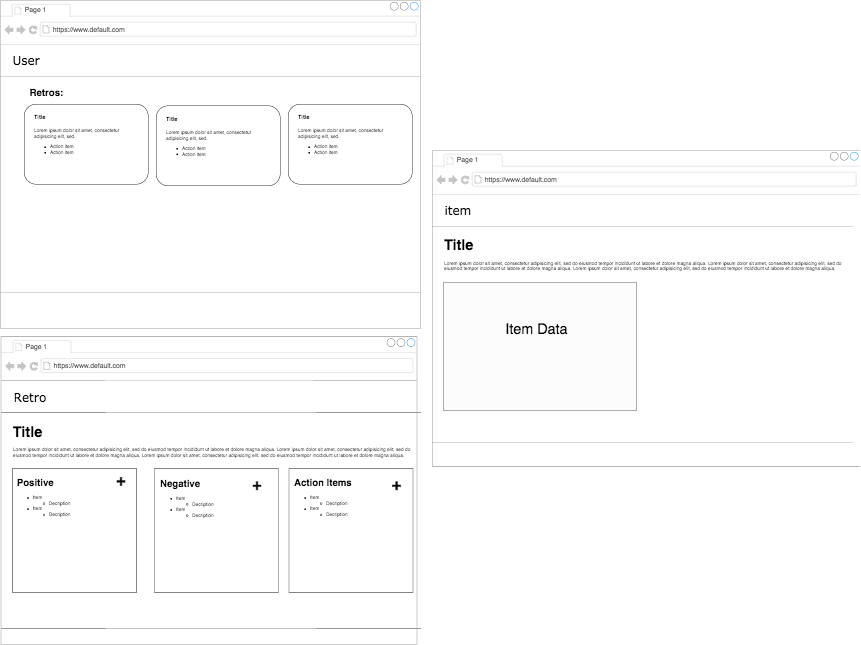
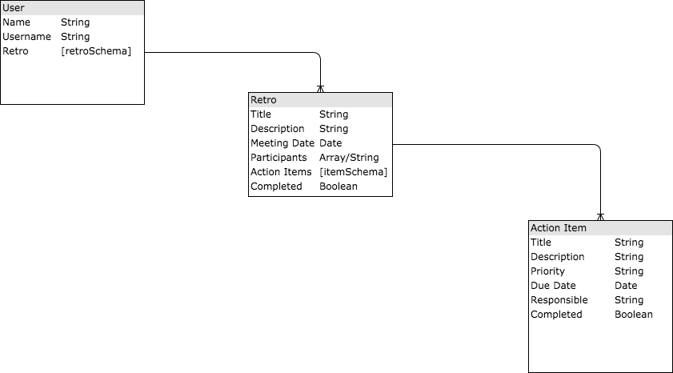

# WDI_Project_2
Retro/Meeting App
---
### Project: Retro'd
### Heroku Link: [Heroku App](https://mears-retrod-app.herokuapp.com/)
### Trello Board: [WDI Project 2](https://trello.com/b/74XgZJik/wdi-project-2-full-stack-crud)
### Technologies Used:
Javascript, JQuery, Css. Built with NodeJs and express, Uilitizing Handlebars for the View and MongoDb for the Database
---
### Goal (v1):
Create an app that allows a user to utilize action items that come out of a retro/feedback meeting. The app will allow users to record data from a retro/feeback meeting and create action items that come out of it. Each action item will have addition information for the user to utilize in tracking the progress of the action item.
---
### Wireframes

---
### ERD:

